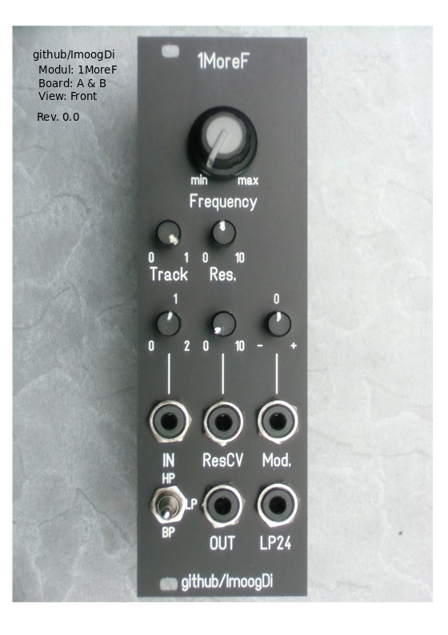
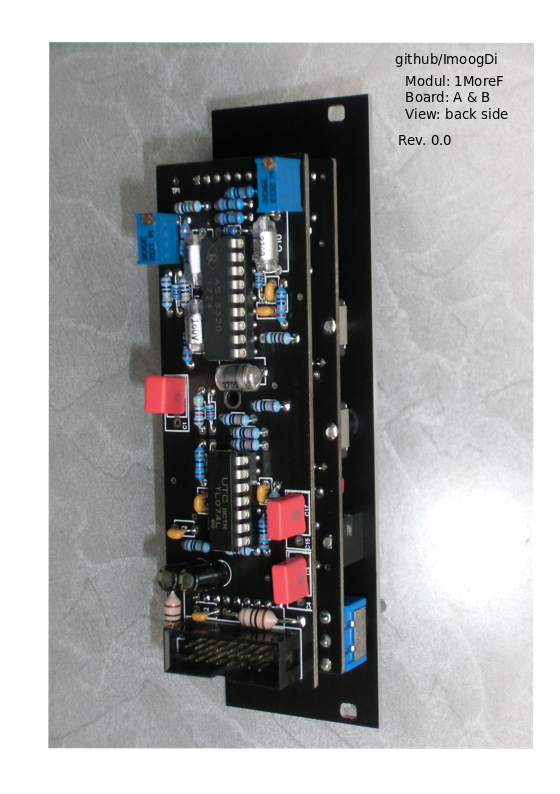

#  1MoreF
> Eurorack filter based on CEM/AS3320 used in Synthesizers.

**Table of Contents**

- [Introduction](#intro)
- [Construction Guide](#constructionguide)
- [Calibration](#calibration)
- [Technical data](#technical-data)
- [License](#license)

## Introduction

- Modul Frontpanel

- Modul Backside

## Construction Guide

- [Details](./doc/constructionguide.md)

## Calibration

- [Details](./doc/calibration.md)

## Technical data

- size:  
  width: 8HP  
  depth: 40mm

- power:  
    5Volt, 0 mA  
  +12Volt, 25mA  
  -12Volt, 25mA  

- frequency range: 20Hz to 20kHz.
- frequency CV scale: 1V/Oct.
- signal input, AC-coupled signal path.
- modulation inputs, DC-coupled signal path.
- signal input impedance: > 50kOhm.
- signal output impedance: 470 Ohm.
- CV-Input impedance: 100kOhm.

## License
> Hardware:cc by-nc-sa 4.0

